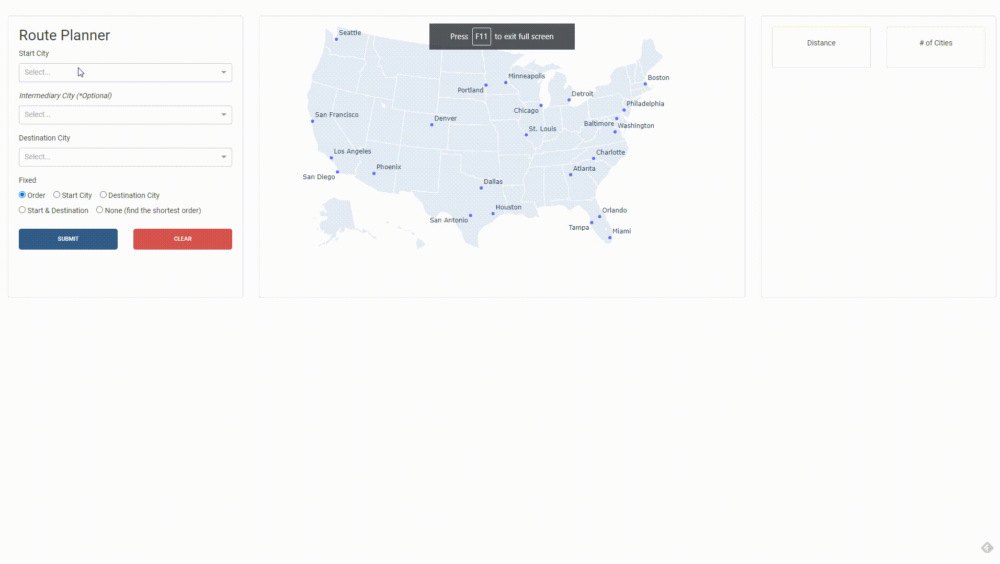

## Kartemap Web Application


<div style="page-break-after: always; break-after: page;"></div>

## Installation

```python
plotly 4.12.0
dash 1.17.0
dash-bootstrap-components 1.13.0
dash-html-components 1.1.1
```


## Get Started

Running the app locally

```cmd
python app.py
```


## Example




## Introduction

#### The top-right controller  

* In addition to select the start city and destination city, users can also add several intermediary cities between them. 

* Moreover, I create a function called fixed for users to find the best route more flexibly. The default is `Order`, that is, the algorithm will find the best route without changing the order `Boston->Dallas->Seattle->Los Angeles`. If users want to find out the shortest route regardless of the order, they have the following options. 

* - **Fix the start city:**  The model will try all kinds of combination to calculate distances, for example, `Boston->Seattle->Los Angeles->Dallas`, `Boston->Dallas->Los Angeles->Seattle`, `Boston-> Los Angeles->Dallas->Seattle`... and so on.  However, the start city will not change in these combinations. 
  - **Fix the destination city:** similar to the option that fix the start city, the model explores the shortest route without changing the end city. 
  - **Fix the start city and the destination city at the same time**
  - **None to fix:** suppose users choose `None` to fix. The application will automatically find out the shortest path, including these cities. The order probably will not be the same as the order they define before.


#### Map

* Before choosing any start city or destination city, the default map looks like the following. It shows all available city options. 


* The map will automatically show the route based on users' choice.


* top-left panel

  * Distance: show the total distance of the route
  * The number of cities: show how many cities the user will pass through
  * Available airlines (drop down menu)

  

  

  

  

  

  

#### Bottom City Information

* Show information of all cities in the route. Information includes images, city names, population, descriptions and `Learn More` links to Tripadvisor 


* The example link to the trip advisor page


