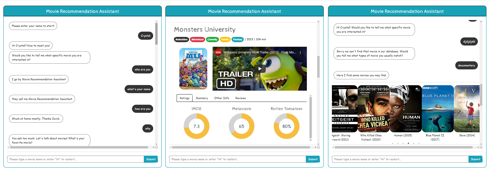
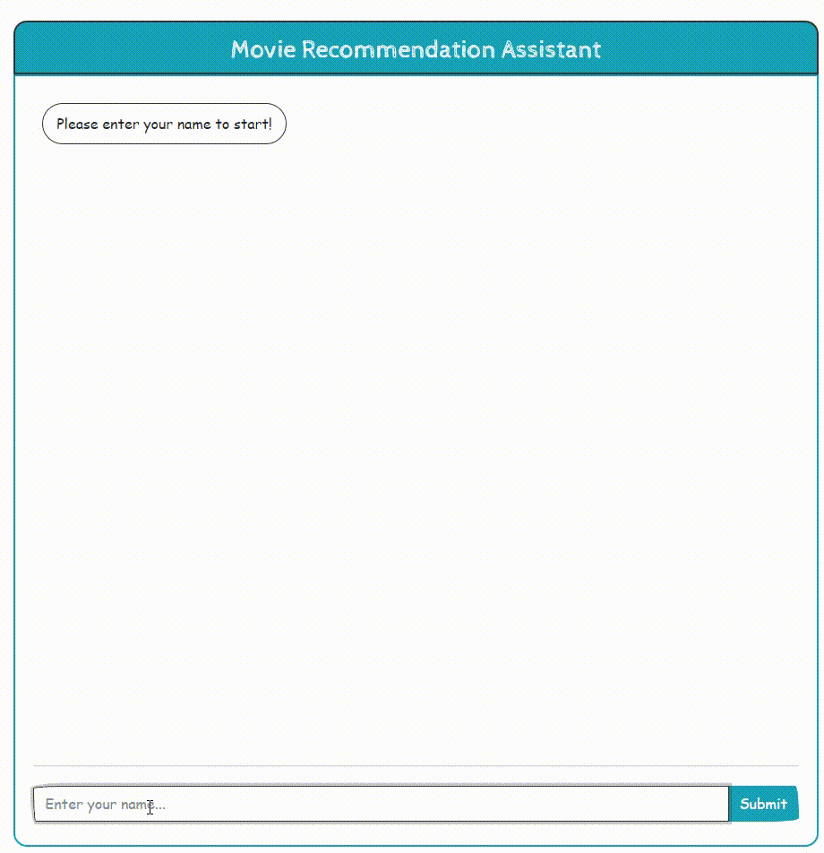

# Chatbot with Dash - Virtual Movie Recommendation Assistant

#### Author: Crystal Lee, Roger Hung

 

Chatbots are increasingly becoming common and a powerful tool to engage users by interacting with them in their natural language. Instead of searching all the movies information manually, which is not only time-consuming but lack of efficiency, we have deployed a simple chatbot by leveraging the power of dash that automates user conversations and helps the user find the movie of interest and what's more, provide recommendations based on the chosen movie. Although being a prototype, our chatbot is capable of looking up some detailed movie information and offer recommendations without any human assistance.

 

This chatbot contains 4 elements:

* Dash Application
* Virtual Movie Recommendation Chatbot Assistant
* KNN Collaborative Filtering Recommender System
* Movie Information Scraper

 

## Features

#### 1. Easily Search for Movie Information

 

#### 2. Recommend Movies

### 3. Chatting

#### 4. Smartly recommend movies

